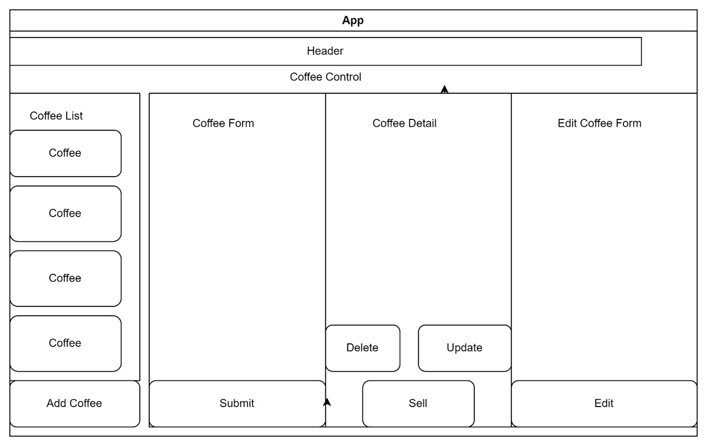

## Inventory Tracker

#### By David Jandron

A web app that tracks inventory for "Why Not Coffee?" coffee shop.

### Technologies Used

* React
* JavaScript
* Node.js
* webpack
* HTML
* CSS

### Description

This application allows the coffee shop staff to track the inventory quantity, varietal, origin, and price. The user can add 130lb bags of coffee to the inventory. They can delete and update the information entered. They can also click a button to sell 1 pound of coffee. For every sale made, the 130lb bag will decrease by 1lb.

### Component Diagram

### Setup/Installation Requirements

* Clone this repository to your desktop
* Navigate to the top level of the directory
* Run the following commands in you terminal:

`npm install`
`npm run start`

### Known Bugs

* N/A

### License

[MIT](https://github.com/jando79/inventory-tracker/blob/main/LICENSE)

Copyright (c) 2023 David Jandron